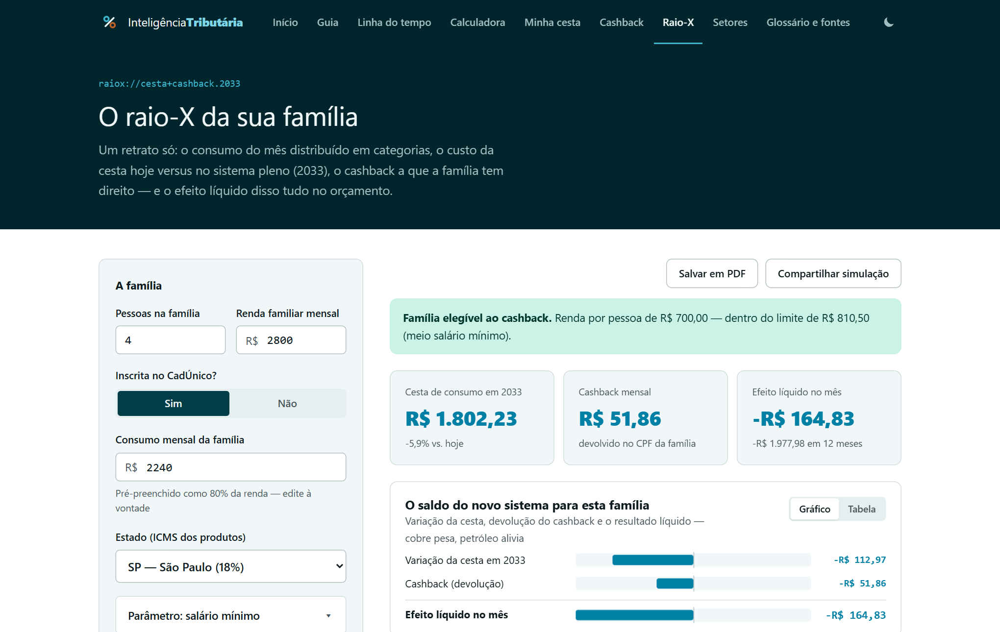
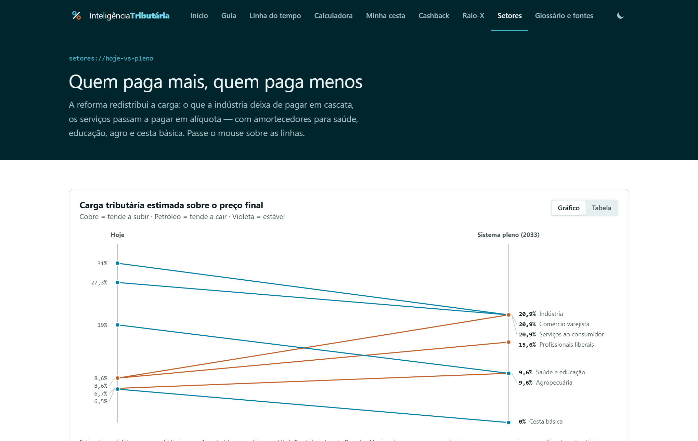

# Inteligência Tributária

**Atlas interativo da Reforma Tributária brasileira** — guia com fontes oficiais, linha do tempo 2023 → 2033, calculadora comparativa, simulador de cashback, raio-X do orçamento da família e painel de impacto por setor. Instalável como PWA.

🔗 **Demo:** https://augustoneon.github.io/inteligencia-tributaria-V2/

> Projeto de portfólio (análise de dados + engenharia frontend). As simulações são **estimativas didáticas** baseadas na EC 132/2023 e na LC 214/2025 — não substituem orientação contábil ou jurídica.

## Telas

| Início | Calculadora comparativa |
|---|---|
|  |  |

| Minha cesta mensal | Linha do tempo |
|---|---|
|  |  |

| Raio-X da família | Impacto por setor |
|---|---|
|  |  |

## O que tem dentro

| Página | O que faz |
|---|---|
| **Guia** | A reforma explicada: por que mudar, o que sai (PIS/Cofins/IPI/ICMS/ISS), o que entra (CBS/IBS/IS), os seis mecanismos-chave — com o **split payment desenhado passo a passo** —, a escada de alíquotas (0% / −60% / −30% / regimes específicos) e FAQ, cada seção com o texto legal anexado |
| **Linha do tempo** | A transição ano a ano (2023 → 2033 + epílogo 2078), sincronizada com um gráfico de área empilhada — e um marcador **"você está aqui"** calculado da data real: dias até a próxima virada e % da transição percorrida |
| **Calculadora** | Compara o preço de hoje com o preço em qualquer ano da transição, por categoria (produto, serviço, cesta básica, saúde, profissional liberal…), com **exemplos de um toque**, **mapa coroplético clicável do ICMS nas 27 UFs** (malha oficial do IBGE), ISS ajustável, link compartilhável e **exportação em PDF** com premissas — e a seção **"dentro ou fora do IVA"**: régua de receita anual (nanoempreendedor → MEI → Simples → regular), opções de regime do vendedor e o crédito que cada escolha transfere ao cliente PJ |
| **Minha cesta** | O orçamento mensal da família inteiro: **perfis de um toque** (essencial / familiar / ampla) ou gastos manuais em 8 categorias, efeito agregado (hoje × qualquer ano) com barras divergentes — compartilhável, exportável em PDF e **em CSV** |
| **Cashback** | Simula a devolução de CBS/IBS para famílias do CadÚnico: teste de elegibilidade, devolução por conta (energia, água, gás, telecom) e projeção anual |
| **Raio-X** | Cesta + cashback num retrato só do sistema pleno (2033): efeito líquido no orçamento da família e a **curva de progressividade** — carga de consumo por faixa de renda, antes e depois do cashback |
| **Setores** | Slope chart de quem tende a pagar mais ou menos no sistema pleno, com a premissa de cada estimativa |
| **Glossário e fontes** | 20+ termos pesquisáveis (com busca sem acento) e a biblioteca de documentos oficiais |

## Decisões técnicas

- **React 19 + TypeScript + Vite**, sem biblioteca de gráficos: todas as visualizações (área empilhada, barras comparativas, donut, slope, barras divergentes e o **mapa coroplético do Brasil**) são **SVG feito à mão**, com tooltips, crosshair, legenda e **gêmeo em tabela** para acessibilidade.
- **Mapa sem dependência de mapa**: os contornos das 27 UFs vêm da malha oficial do IBGE (API de malhas v3), projetados e simplificados por um script próprio (`scripts/gera-mapa-brasil.mjs`) que emite dados TypeScript versionados — nada de topojson/d3 em runtime.
- **Motor de cálculo isolado** (`src/lib/engine.ts`): modela tributos "por dentro" (sistema atual) vs. IVA "por fora" (novo), incluindo os anos de convivência 2027–2032 com fator de ICMS/ISS. Fórmula central: `P = B × (1 + t_fora) / (1 − t_dentro)`.
- **Dados como código** (`src/data/*.ts`): cronograma da transição, categorias com referência legal, regras de cashback e fontes — tudo tipado e versionado.
- **Paleta validada para daltonismo** (ΔE adjacente ≥ 15 em simulação deutan/tritan) com codificação semântica: família ferrugem = tributos em extinção, família petróleo = IVA dual, violeta = Imposto Seletivo.
- **Testes automatizados (Vitest)** cobrindo os motores de cálculo — fórmulas por dentro/por fora, anos de convivência, reduções, elegibilidade e regras do cashback — executados no CI antes de cada deploy.
- **Tema claro/escuro** com paleta de dados própria para cada superfície (o escuro não é inversão: cada passo foi revalidado no script de acessibilidade), persistido em `localStorage` e sem flash de tema na carga.
- **Simulações compartilháveis**: o estado da calculadora, da cesta, do cashback e do raio-X vira query string — no celular abre a folha nativa de compartilhamento (`navigator.share`), no desktop copia o link para mandar ao contador. A cesta também exporta **CSV pt-BR** (separador `;`, vírgula decimal, BOM p/ Excel) sem dependência.
- **Instalável (PWA)**: manifest + service worker próprios — rede primeiro nas páginas (conteúdo sempre fresco, fallback offline), cache primeiro nos assets imutáveis do Vite; ícones gerados por script a partir da arte do favicon (`scripts/gera-icones.mjs`).
- **Radar da reforma**: os marcos da regulamentação (EC 132 → LC 214/2025 → LC 227/2026) verificados e datados na página inicial, cada um com link para o texto oficial.
- **Relatório em PDF sem biblioteca**: uma folha de impressão dedicada (`styles/print.css`) transforma a simulação num relatório — cabeçalho com parâmetros e data, premissas abertas automaticamente, sempre no tema claro com cores exatas — via `window.print()`.
- **HashRouter + base relativa** para funcionar no GitHub Pages sem configuração de servidor; deploy automático via GitHub Actions.
- Contraste AAA no texto (corpo 17,6:1; secundário 7,7:1), `prefers-reduced-motion` respeitado, gráficos com `role="img"` e `aria-label`.

## Rodando localmente

```bash
npm install
npm run dev      # http://localhost:5173
npm test         # suite de testes dos motores de cálculo (Vitest)
npm run build    # type-check + build de produção em dist/
```

## Fontes oficiais

- [Emenda Constitucional nº 132/2023](https://www.planalto.gov.br/ccivil_03/constituicao/emendas/emc/emc132.htm) — cria IBS, CBS e Imposto Seletivo
- [Lei Complementar nº 214/2025](https://www.planalto.gov.br/ccivil_03/leis/lcp/lcp214.htm) — regulamentação geral (alíquotas, regimes, cashback, split payment)
- [Lei Complementar nº 227/2026](https://www.planalto.gov.br/ccivil_03/leis/lcp/lcp227.htm) — Comitê Gestor do IBS (origem: PLP 108/2024)
- [Programa da Reforma Tributária do Consumo — Receita Federal](https://www.gov.br/receitafederal/pt-br/acesso-a-informacao/acoes-e-programas/programas-e-atividades/reforma-tributaria-do-consumo)

Alíquota de referência usada nas simulações: **26,5%** (CBS 8,8% + IBS 17,7%) — estimativa oficial do Ministério da Fazenda, com trava legal na LC 214/2025.

## Estrutura

```
src/
├── data/        # conteúdo da reforma: transição, categorias, cesta (+ perfis), cashback, faixas de renda, novidades, setores, glossário, fontes, malha do Brasil
├── lib/         # motores de cálculo (comparativo, cesta mensal, cashback, regimes do vendedor, raio-X, progressividade), posição temporal e formatação pt-BR
├── components/
│   ├── charts/  # kit de gráficos SVG próprio (área, barras, donut, slope, mapa do Brasil, moldura c/ tabela)
│   ├── ui/      # tiles, callouts, campos, sanfona, chips, links de fonte, relatório impresso
│   └── layout/  # topbar, cabeçalho de página, rodapé
└── pages/       # Início, Guia, Linha do tempo, Calculadora, Minha cesta, Cashback, Raio-X, Setores, Glossário
```
